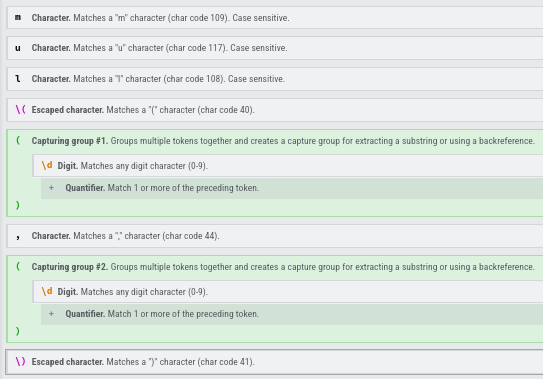

+++
date = '2025-09-17T20:12:42-03:00'
draft = false
title = 'Advent of Code 24 Day 3'
tags = ["AdventOfCode24", "Programming", "C++"]
quickSummary = "Third puzzle! Regex is fun!"
+++

[Link to the github repository](https://github.com/gabrielholzmann/AdventOfCode24)

Here are some of the characteristics you will find in my solutions:
- All of my puzzles will be solved in C/C++
- I will not provide my personal input
- If you have any suggestions, comments or optimizations to my code please [contact me](/contact)

First of all get acquainted to the puzzle in this [link](https://adventofcode.com/2024/day/3)

# Part 1

If you read the puzzle you know it's about findings patterns a perfect task for regex

## Main

Our main consists of:
1. Opening a file
2. Reading the instructions
3. Evaluating instructions with regex

```cpp
int main() {
    std::fstream inputFile = openFile("../input.txt");

    memory m = readInstructions(inputFile);

    std::cout << evaluateMultiplyInstructions(m);

    return 0;
}
```

## Opening a file

Just the standard file opening and checking for errors

```cpp
std::fstream openFile(const std::string &fileName) {
    std::fstream fp;
    fp.open(fileName, std::ios::in);

    if (!fp.is_open()) {
        throw std::runtime_error("Could not open file");
    }

    return fp;
}
```

## Reading the Instructions

We create a struct with a vector to hold our instructions, and then we 
loop through every line and push those instructions to the vector

```cpp
typedef struct memory {
    std::vector<std::string> instructions{};
} memory;

memory readInstructions(std::fstream &fp) {
    memory m;

    std::string line;
    while (std::getline(fp, line)) {
        m.instructions.push_back(line);
    }

    return m;
}
```

## Building our regex

My favorite way to build a regex expression is going to [regexr.com](https://regexr.com)
and playing a little bit, like a sandbox.

We can place the example string from the problem and try to come up with a regex expression,
the website makes this a lot easier by including a cheat sheet and analyzing tools

My expression:

```cpp
const auto regexExpression = std::regex (R"(mul\((\d+),(\d+)\))");
```

Here you can see a full on explanation of my expression generated by the website.
Those 2 capturing groups are very important so we can get the operands easily.



## Matching our expression

**evaluateMultiplyInstructions()** just loops through every line and sends it to **matchRegexLine()**

**matchRegexLine()** first creates and std::smatch where our matched string resides while std::regex_search matches something:
1. transform both capture groups 1 and 2 to integer multiply then and add to the total
2. go to the next match

Important to notice capture group 0(match.str(0)) is the entire match

```cpp
int matchRegexLine(std::string line) {
    int total = 0;

    std::smatch match;
    while (std::regex_search(line, match, regexExpression)) {
        total += std::stoi(match.str(1)) * std::stoi(match.str(2));

        line = match.suffix().str();
    }

    return total;
}

int evaluateMultiplyInstructions(memory &m) {
    int total = 0;

    for (const auto &line : m.instructions) {
        total += matchRegexLine(line);
    }

    return total;
}

```

## Part 2


\*Everything else not mentioned here is the same as part 1

## Memory Structure

We added a isEnabled variable that defaults to true

```cpp
typedef struct memory {
    std::vector<std::string> instructions{};
    bool isEnabled{true};
} memory;
```

## Regex Expression

Now we change our regex expression to match the do() and don't()

The only difference here is that we added two or conditions 
- do\(\) = Matches do() string
- | = OR
- don't\(\) = Matches don't() string
- | = OR
- previous match = Same as part 1

```cpp
const auto regexExpression = std::regex (R"(do\(\)|don't\(\)|mul\((\d+),(\d+)\))");
```

## Matching

First we check the full match to see if it's a do() or a don't() and if it is we enable or disable the memory

If the memory is enabled and is not a do() or don't() we multiply and add it to the total using the capture groups

```cpp
int matchRegexLine(memory &m, std::string line) {
    int total = 0;
    std::smatch match;

    while (std::regex_search(line, match, regexExpression)) {
        std::string fullMatch = match.str(0);

        if (fullMatch == "do()") {
            m.isEnabled = true;
        }
        else if (fullMatch == "don't()") {
            m.isEnabled = false;
        }
        else if (m.isEnabled) {
            total += std::stoi(match.str(1)) * std::stoi(match.str(2));
        }

        line = match.suffix().str();
    }

    return total;
}
```


